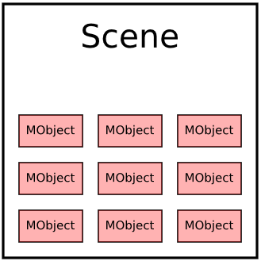
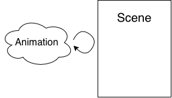
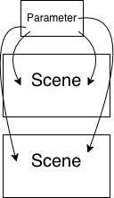
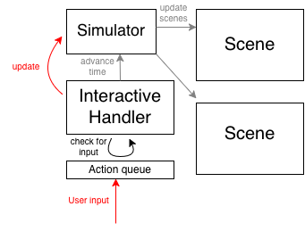

`math-applets` is a software library designed for the purpose of easily making animations and interactive visualizations of mathematics, similar to how one would write LaTeX code to typeset a static document.

This document captures the core components and abstractions. If you want to use `math-applets` in anything more than a cursory way, I highly recommend reading this document. If you want to contribute to the codebase, this document is required reading.

### High-level view

At a high level, math-applets is an engine which can be used to programmatically build mathematical applets. Similar to how LaTeX can be used to programmatically typeset mathematics (primarily symbolic), and [manim](https://www.manim.community/) can be used to programmatically create video animations, math-applets is used to create video components which a user can directly interact with, enhancing the learning experience. If LaTeX is used to write papers and books, and manim is used to make videos and movies, then math-applets can be used to make games.

The core components are now introduced in natural sequence, progressively adding layers of complexity.

### Components

## `Scene` and `MObject`

`Scene` and `MObject` are arguably the most fundamental classes within the library. They are modeled directly after the corresponding classes in [manim](https://www.manim.community/), the Python library produced by Grant Sanderson for animations  [3Blue1Brown](https://www.3blue1brown.com/).

<p align="center">
    
</p>

A `Scene` corresponds to a single canvas element on a webpage. A `MObject` is a geometric instantiation of a mathematical object. `MObject`s can be freely added to or removed from a `Scene`, which is then drawn in its totality with the `Scene.draw()` command. For example, examine the following snippet of Typescript code, which is preceded by code which defines a `canvas` element in the page. This first defines a scene containing two points and a segment connecting them, and then draws it to the canvas.

```
// (...preceded by code to define a "canvas" object)
let scene = new Scene(canvas);
let xmin = -5;
let xmax = 5;
let ymin = -5;
let ymax = 5;

scene.set_frame_lims([xmin, xmax], [ymin, ymax]); // Set the x-coordinates and y-coordinates defining the canvas boundaries

// Define the mobjects
let p0 = new Dot([2, 0], 0.1);
let p1 = new Dot([-2, 0], 0.1);
let line = new Line([-2, 0], [2, 0]);

// Add the mobjects to the scene
scene.add("first_endpoint", p0);
scene.add("second_endpoint", p1);
scene.add("connecting_segment", line);

// Draw the scene
scene.draw();
```

`MObject`s can be points, lines, polygons, curves, surfaces (in 3 dimensions), two-dimensional heatmaps, etc. They can also be vectorized mobjects representing text (`TextMObject`) or mathematical formulas (`TeXMObject`).

The key defining feature is that a `MObject` must be drawable. Each `MObject` has a `_draw()` method which gives the renderer explicit instructions (through the `ctx` interface) on how to draw it, based on its internal state. For example, a `Dot` has a `center: Vec2D` and `radius: number`, while a `Line` has a `start: Vec2D` and `end: Vec2D`.

Meanwhile, the `Scene` provides display options, such as the frame size, the coordinate conversion between canvas coordinates (in pixels) and scene coordinates, color scheme, and a camera position and lighting options for 3D scenes.

A typical mathematical scene will be composed of a large number of MObjects. The complexity of such scenes can be tamed by grouping the elements into `MObjectGroup`s, which makes it more convenient to collectively move, animate, or re-style a collection of MObjects. For example, the illustrative diagram near the beginning of this subsection was rendered from a `Scene` containing 10 `MObjectGroup`'s, where each `MObjectGroup` contains a single `Rectangle` and a single `TextMObject`.

For more predefined examples pertinent to mathematics, see e.g. `Histogram` or `CoordinateAxes2D`.

These components are already sufficient for producing sophisticated static mathematical diagrams, which can either be displayed on a webpage or written to file.

## Interactive elements

One primary reason to create this software library (rather than directly using [manim](https://www.manim.community/)) was to add interactivity to mathematical scenes. Learning is greatly enhanced when the reader can directly and tangibly interact with the ideas presented: for example, clicking-and-dragging a screen element, which modifies a mathematical parameter controlling a diagram, and then observing the changes. I was particularly inspired by seeing the beautiful and highly-polished scenes created by Bartosz Ciechanowski at his [blog](https://ciechanow.ski/).

Broadly, such interactive components and patterns of behavior are placed in `lib/interactive/`. `Button` and `Slider` are two basic interactive elements inherited from standard web development, which do what you'd expect. When the user clicks a `Button`, a pre-defined function is triggered. When the user clicks and drags at a position on a `Slider`, a parameter changes and calls an update function.


There are also ways to add interactivity directly into a scene itself: for example, add the ability for the user to click-and-drag an existing object within the `Scene`. The function `makeDraggable` applies this behavior to `MObjects` which have the necessary utility functions defined.

One might also want to click the background canvas of a scene and move the view around to explore the contents of the scene. This is captured by `SceneViewTranslator` and `Arcball`.

## `Animation`

The next component is also drawn directly from manim. We'd like to be able to create scenes which change in real-time, i.e. *animations*. An `Animation` captures this requirement. For example, the following snippet of code fades a new pair of coordinate axes into an existing scene over a duration of 20 frames, ending with the axes as a `MObject` in the scene.

```
// (previous code defines a scene)
let axes_mobj = new CoordinateAxes2d([-5, 5], [-5, 5]);
let animation = new FadeIn({"axes": axes_mobj}, 20);
await animation.play(scene);
```

While Scenes and MObjects should be thought of as *data* living within the runtime, an Animation should be thought of as a sequence of instructions -- i.e. a *program* -- to be executed by the runtime. Because of their real-time nature, Animations require asynchronous behavior. 

<p align="center">
    
</p>

Animations can be interlaced and overlayed by utilizing custom animation classes. The frame rate can also be tweaked as a system setting. With `Animation`s, one can create playable videos and trigger-able animations.

## Abstract parameters

We sometimes may want to use multiple different scenes (i.e. canvases on the screen) to display a single *underlying* object, but from different perspectives. This is because mathematical constructions have different visual representations. For example, a number can be represented in decimal format, or as a point on a number line. We would represent these two representations as two distinct `MObject`s (possibly in two separate `Scene`s), but they would need to be linked to a single underlying source of truth.

<p align="center">
    
</p>

This requirement is most simply captured by the `Parameter` class. A `Parameter` is invisible and not drawn (and need not be added to any `Scene`), but is equipped with a set of callback functions (typically modifying other `MObject`s), such that whenever the `Parameter` has its value changed, it executes all of these callbacks. More complex dependencies can be specified with more complex variants of `Parameter`.

## `Simulator` and `InteractiveHandler`

Sometimes, the said object in the situation above may be an entire autonomous simulation which runs in real-time, e.g. according to a differential equation. For example, we might wish to have three scenes, where the first scene displays a physically swinging pendulum, the second plots its position versus time as a graph, and the third its state as a trajectory in phase space, with all three scenes changing simultaneously in real-time. To take it further, we may wish to have a single slider element below which controls the strength of gravity, and which affects all three scenes simultaneously.

This requirement is captured by `Simulator` class, and the `InteractiveHandler` class. `Simulator` abstractly models a mathematical simulation, consisting of an underlying state which evolves in a step-wise fashion according to a `step()` function. InteractiveHandler acts as a central mediator among the user (who inputs interaction commands), the simulators (which tick forward at the command of the InteractiveHandler), and the scenes (which update and draw themselves at the command of the InteractiveHandler). The InteractiveHandler maintains an internal queue of user-commands, and checks this queue at each timestep of the simulation to see whether it should execute them.

<p align="center">
    
</p>

This architecture is captured in the diagram above, where the InteractiveHandler checks the action queue at each timestep, and executes via the red arrow if there are any outstanding updates to perform (perhaps delivered via an interactive element, such as a `Slider`), and otherwise by default performs the gray arrows.

One would build an architecture like this using the code snippet below.

```
let handler = new InteractiveHandler();

const dt = 0.01;
let sim = new Simulator(dt); // replace with any specific form of simulator

let scene = new SceneFromSimulator(canvas); // replace with a scene whose objects depend on the chosen simulator

handler.add_sim(sim); // Add the simulator: handler is initially paused
handler.add_scene(scene);

// (... add code here which creates a slider which tells the handler to tweak the simulator ...)

handler.add_pause_button(pause_button_html_element);  // Adds a pause button linked to an existing HTML element

handler.play(100); // Set the simulator running up until time 100, or until paused
```

This pattern has been stress-tested in the codebase by two canonical examples of partial differential equations: the two-dimensional wave equation and heat equation.

## Rendering

At present, rendering is done within the `MObject._draw()` methods themselves, but eventually one should call to an external renderer class. I'd like support for multiple renderer classes. I'd also like to toggle between writing-to-screen versus writing-to-file.

### Cross-cutting concerns

This is a list of meta-level comments about the structure and useability of the library.

# Useability

The useability of the library is wanting. It's not immediate to write a simple script and get a result out. At present, creating an interactive page requires writing two separate files: an HTML file which dictates the layout of the canvases and various other elements, and a Typescript file which populates and interacts with these elements. Moreover, the former must be placed in `dist/` while the latter must be placed in `src/`, and the latter must adhere to a certain naming convention. This is an annoyance to even me, so it's certain to be a headache for new users.

# Testing

No unit tests have been written, primarily because testing the functionality of new features amounts to manually seeing how they look in a rendered scene. The various existing `*_scene.ts` files serve this purpose: before merging any new feature, I re-compile all of these files and manually inspect that every scene loads and performs as expected. While I think this is the *right* testing paradigm for complex, end-to-end features, it is not a scalable model, and so the library (and its tests) should eventually be sequestered into individual modules. Most of the features for which unit tests could be easily written are trivial to verify by inspecting the appropriate method implementation (e.g., checking that `Dot.move_by([1, 0])` changes a Dot's center position by `[1, 0]`), but perhaps some number of automated "smoke tests", modeled after the code in the scenes above, are in order.
